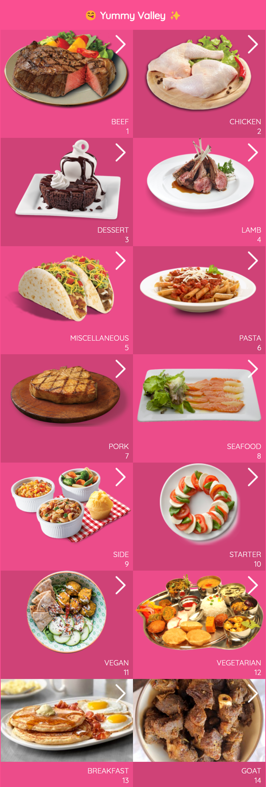
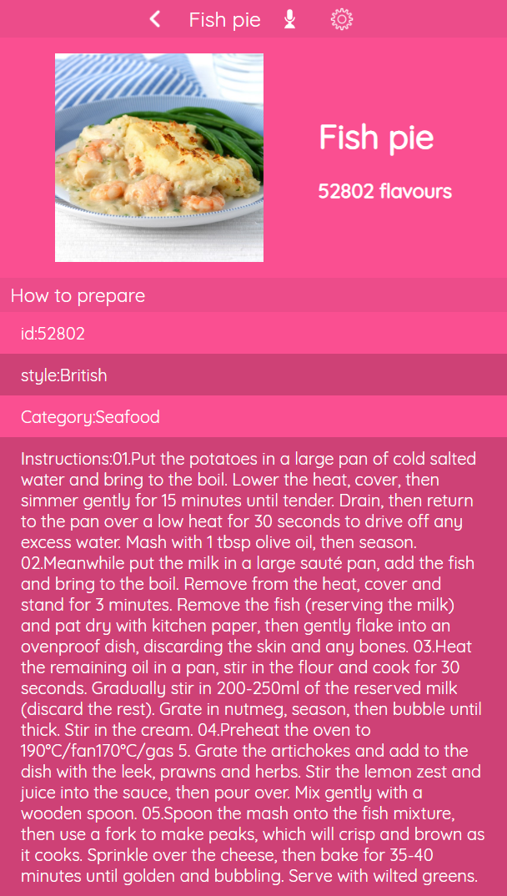

# YummyValley

> The amazing YummyValley teaches you various magical methods to create a delicious yummy meal.
> There are lots of categories starting from breakfast.
> YummyValley is userfriendly and easy to use website for preparing homemade meals.

## Built With

- JavaScript
- React
- Redux
- React Testing Library

## Screenshots

## Getting Started

To get a local copy up and running:

1. Clone this repository or download the zip folder:

**`git clone https://github.com/rex-9/yummyvalley.git`**

2. Navigate to the location of the folder in your machine:

**`you@your-Pc-name:~$ cd yummyvalley`**

3. Open the project with VScode:

**`code .`**

4. Build the node packages:

**`npm run build`**

5. Run the server:

**`npm start`**

### Deployment

Here is the online version of [yummyvalley](https://yummyvalley.netlify.app/)

## Rex

👤 - Github: [@rex-9](https://github.com/rex-9/) 
👤 - Medium: [@rex9](https://medium.com/@rex9/) 
👤 - LinkedIn: [@rex9](https://www.linkedin.com/in/rex9/) 
👤 - Angelist: [@rex9](https://angel.co/u/rex9) 
👤 - Facebook: [@htetnaing0814](https://www.facebook.com/htetnaing0814) 
👤 - Twitter: [@htetnaing0814](https://www.twitter.com/htetnaing0814) 

## 🤝 Contributions

Contributions, issues, and feature requests are welcome!

Feel free to check [issue page](https://github.com/rex-9/yummyvalley/issues).

## Show your support

Give a ⭐️ if you like this project!

## Acknowledgments

[Microverse](https://bit.ly/MicroverseTN)

Original design idea by - [Nelson Sakwa on Behance](https://www.behance.net/sakwadesignstudio).

## 📝 License

This project is [Creative Commons](https://creativecommons.org/licenses/by-nc/4.0/) licensed.
